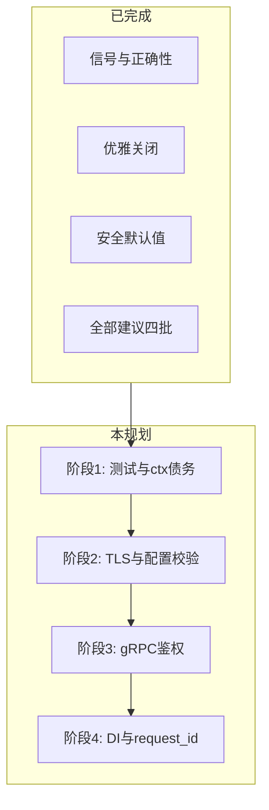
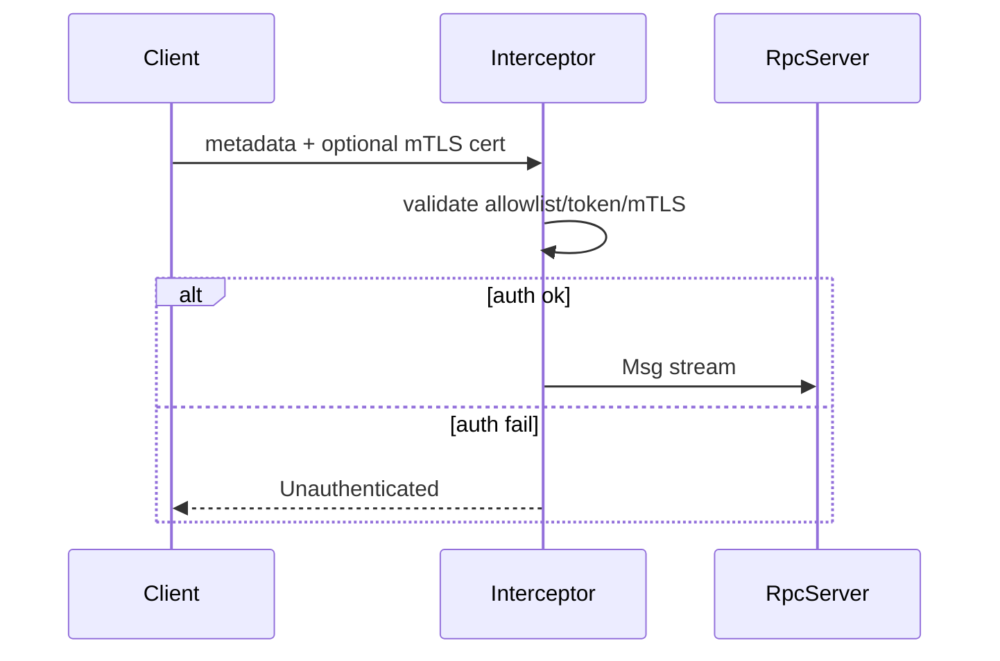
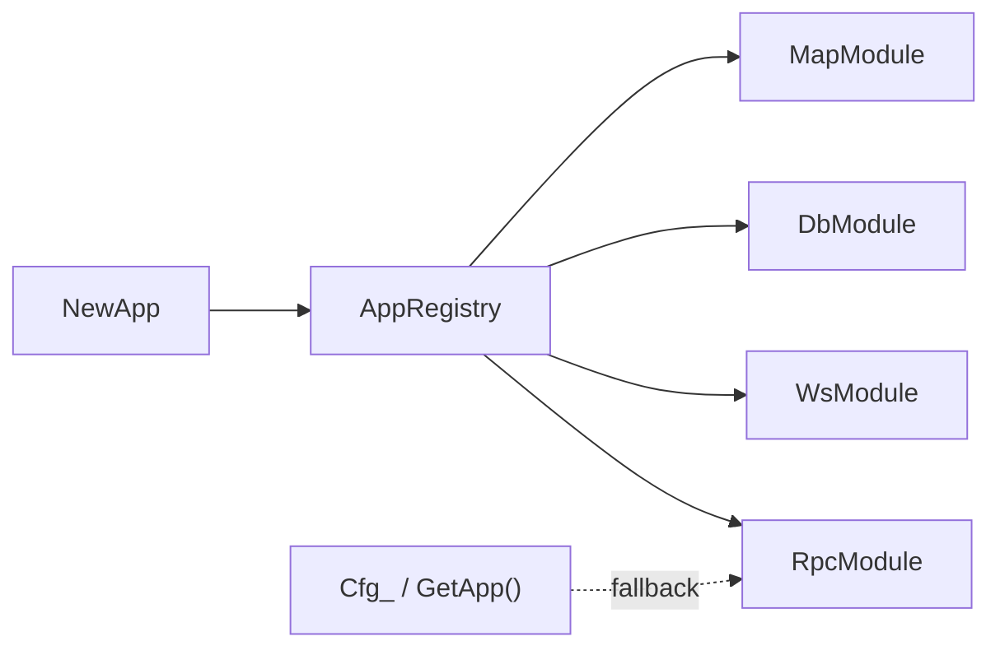

# TouchGoCore 剩余工作全部规划

## 已完成基线（本规划不再重复）

以下已在当前代码中落地，作为后续工作的前提：

- 信号/nohup、优雅关闭、Mongo/ini/syncmap/RPC stream 等 P0–P2 修复
- `CONFIG_PATH`、示例 CORS/Origin/`trusted_proxies`、网关 `SetAuthFunc`（[`example/gatewayserver/gatewayserver.go`](example/gatewayserver/gatewayserver.go)）
- 协议 `(p1,p2)` 注册表；[`util/echoProtocol.go`](util/echoProtocol.go) 中 `PasreFSMessage` **拒绝未注册协议**
- Lua `Update` 串行；RPC `DoWithRetCtx`；`websocket`/`lua`/`rpc`/`gin`/`telegram` 接入 `app.ctx`
- `App.Context()` 对外暴露



---

## 阶段 1：正确性、测试与上下文债务（优先，风险低）

### 1.1 修复失败单测

| 包 | 现状 | 方向 |
|---|---|---|
| [`list/list_test.go`](list/list_test.go) | `TestRemove`/`TestRemoveHead`/`TestRemoveTail`/`Range` 失败 | 调试 [`list/node.go`](list/node.go) `Remove()` 与 [`list/list.go`](list/list.go) `removeNodeLocked`；重点排查 `sync.Pool` 复用（[`list/pool.go`](list/pool.go)）导致测试持有已回收节点指针；必要时测试中禁用池或删除后断言前刷新 Head/Tail |
| [`ranking/ranking_test.go`](ranking/ranking_test.go) | 历史 nil/排名断言失败 | 跑 `go test ./list/... ./ranking/...` 定位；`NewRankTree()` 已初始化 `Sl`，重点查跳跃表比较/排名计算与 `GetRankTree` 全局路径 |

**验收**：`go test ./list/... ./ranking/...` 全绿；`go build ./...` 保持通过。

### 1.2 各服务真正消费 `app.ctx`

[`app.go`](app.go) 中仍有适配器忽略 `ctx`：

```69:77:app.go
func (s *timerService) Start(_ context.Context) error {
	localtimer.Run()
	return nil
}
func (s *timerService) Stop(_ context.Context) error {
	localtimer.TimeStop()
	return nil
}
```

- **timer**：`localtimer.Run(ctx)` / `TimeStop(ctx)`，主循环 `select` 监听 `ctx.Done()`
- **map**：[`mapmanager/map.go`](mapmanager/map.go) `RunMap` 返回 error 并向上传递；Stop 随 ctx 取消
- **websocket Stop**：改为 `Stop(ctx)`，与 Start 对称
- **Shutdown 闭包**：[`app.go`](app.go) L342 循环内 goroutine 应显式捕获 `svc := app.services[i]`（兼容旧 Go 写法）

### 1.3 RPC 超时后孤儿 goroutine

[`rpc/server.go`](rpc/server.go) L200–257：超时后 handler goroutine 仍可能继续执行。

- 回调签名已支持 `context.Context` 首参（[`util/callback.go`](util/callback.go) `DoWithRetCtx`）
- 补充：超时路径记录 in-flight 计数；文档要求业务 handler 必须接受 `ctx` 并在阻塞 IO 上使用
- 可选：handler 池 + `context.WithCancel` 在超时后调用 `cancel()`（需 handler 配合）

### 1.4 配置 API 债务

- [`config/config.go`](config/config.go) `Load()` 仍 `panic`：标记 `Deprecated`，文档指向 `LoadWithError`；长期可删
- 新增 `Cfg.Validate()`：必填项（端口冲突、TLS 文件存在性、WS auth 与 origin 组合合理性）在 `NewApp` 加载后调用

---

## 阶段 2：HTTP / WebSocket 内置 TLS

当前 Gin / WS 均走明文 [`gin/run.go`](gin/run.go) `ListenAndServe`、[`websocket/server.go`](websocket/server.go) `ListenAndServe`；仅 gRPC 有 TLS 配置（[`config/struct.go`](config/struct.go) `RpcTLSConfig`）。

### 2.1 配置扩展

在 [`config/struct.go`](config/struct.go) 增加可复用结构：

```go
type TLSConfig struct {
    Enable   bool   `json:"enable"`
    CertFile string `json:"cert_file"`
    KeyFile  string `json:"key_file"`
}
```

- `WebConfig.TLS *TLSConfig`
- `WebsocketConfig.TLS *TLSConfig`（或每端口 TLS，视部署需求）

### 2.2 启动路径

- Gin：`ListenAndServeTLS` 或 `tls.Listen` + `Serve`
- WebSocket：同样挂 `http.Server` TLS；`wss://` URL 写入日志/配置回显
- 失败时启动 rollback（已有 Start 失败回滚机制）

### 2.3 示例与文档

- 更新 [`config/example.json`](config/example.json)、[`example/conf/gatewayserverbus.json`](example/conf/gatewayserverbus.json) 增加 TLS 示例块（默认 `enable: false`）
- 说明：生产可在前置 Nginx 终结 TLS，框架 TLS 用于直连场景

---

## 阶段 3：gRPC 真实鉴权

### 3.1 现状缺口

[`rpc/server.go`](rpc/server.go) `Msg()` 仅校验 metadata 存在且 `client-name` 非空——**客户端可伪造身份**。TLS 可被 `skip_for_intranet` / per-client `use_tls: false` 绕过（[`rpc/run.go`](rpc/run.go) `resolveTLSConfig`）。

### 3.2 目标设计

在 [`config/struct.go`](config/struct.go) `RpcConfig` 增加 `Auth` 段：

| 模式 | 行为 |
|---|---|
| `none` | 仅内网调试（默认关闭于 production 文档警告） |
| `allowlist` | `client-name` 必须在配置白名单 |
| `token` | metadata `authorization: Bearer <secret>` 与配置比对 |
| `mtls` | 服务端 `ClientAuth: RequireAndVerifyClientCert`，CA/客户端 cert 配置 |

实现：

- `grpc.ChainUnaryInterceptor` / `StreamInterceptor`（或在 bidi `Msg` 入口统一校验）
- 客户端 [`rpc/client.go`](rpc/client.go) 对应附加 metadata / 客户端证书
- **生产默认**：`skip_for_intranet: false` + TLS enable；内网 skip 需显式 opt-in 并打 WARN 日志



---

## 阶段 4：App 依赖注入（最大项，分步迁移）

### 4.1 问题

模块仍依赖包级全局：

| 全局 | 位置 | 用途 |
|---|---|---|
| `config.Cfg_` | [`config/config.go`](config/config.go) | 全库读配置 |
| `globalApp` / `GetApp()` | [`app.go`](app.go) | 业务反查 App |
| `db._DbMap` | [`db/map.go`](db/map.go) | 命名 DB 实例 |
| `rpc.service_` / `rpcClient_` | [`rpc/run.go`](rpc/run.go) | RPC 注册表 |
| `clientMap` | [`websocket/client.go`](websocket/client.go) | WS 连接 |
| `_maplist` | [`mapmanager/map.go`](mapmanager/map.go) | 地图实例 |
| `util.DefaultCallFunc` | 全局回调 | INI/Start/Stop |

`App` 已持有 `Cfg`、Redis/MySQL/Mongo（[`app.go`](app.go)），但下游模块未注入。

### 4.2 迁移策略（保持向后兼容）

**Step A — App 作为 Registry（不破坏现有 API）**

- `App` 增加字段：`rpcRegistry`、`wsHub`、`databases`、`callFunc`
- `NewApp` 初始化这些字段；模块 `Run(ctx, opts...)` 增加 `WithApp(*App)` 或内部从 `ctx` value 取 App
- 保留 `config.Cfg_ = app.Cfg` 同步写入，旧代码继续工作

**Step B — 模块读 App 优先**

- `rpc.Run` / `websocket.Run` / `db.Get` 等：**优先**从 App registry 读，fallback 全局
- 单元测试可构造独立 `App` 而不污染全局

**Step C — 废弃全局**

- Go 1.25 `//go:deprecated` 注释 + 文档
- 主版本或 v2 移除 `Cfg_`、`GetApp()` 单例



---

## 阶段 5：bidi RPC 请求关联（协议破坏性变更）

### 5.1 现状

[`network/proto/FSMessage.proto`](network/proto/FSMessage.proto) `Head` 无 `request_id`；[`rpc/client.go`](rpc/client.go) 靠 `streamMu` 串行 Send/Recv，吞吐受限且无法安全并发。

### 5.2 变更

1. Proto 扩展（需与所有调用方协调版本）：

```protobuf
message Head {
  optional int32 protocol1 = 1;
  optional int32 protocol2 = 2;
  optional string cmd = 3;
  optional uint64 request_id = 4;  // 新增
}
```

2. 客户端：单调递增 `request_id`；`pending map[uint64]chan` 等待响应
3. 服务端：响应回填相同 `request_id`
4. 可逐步放开 `streamMu` 为「Send 锁 + Recv 分发 goroutine」
5. 旧客户端无 `request_id` 时：兼容模式仍串行（`request_id == 0`）

**注意**：需 regenerate `network/message/*.pb.go` 并同步业务 protobuf 仓库。

---

## 阶段 6：示例、运维与文档

### 6.1 示例网关协议注册

[`example/gatewayserver/gatewayserver.go`](example/gatewayserver/gatewayserver.go) 仅有注释，未调用 `RegisterProtocolType`。应注册示例业务消息，否则 WS/RPC 流量会被拒。

### 6.2 运维模板

- 新增 [`example/deploy/touchgo.service`](example/deploy/touchgo.service) systemd unit（`Environment=CONFIG_PATH=...`、`Restart=on-failure`、`KillSignal=SIGTERM`）
- README 片段：`nohup` vs `disown` vs systemd；强调 SIGHUP 已 ignore、关闭仍靠 SIGTERM

### 6.3 配置迁移指南

- 旧 json 缺 `allow_origins` / `allowed_origins` 的行为说明
- 生产 checklist：WS token、协议注册、gRPC TLS/auth、trusted_proxies

---

## 建议实施顺序与工作量

| 顺序 | 阶段 | 预估 | 依赖 |
|:---:|---|:---:|---|
| 1 | 阶段 1 测试 + ctx 债务 | 1–2 天 | 无 |
| 2 | 阶段 2 HTTP/WS TLS | 1 天 | 配置 struct |
| 3 | 阶段 3 gRPC 鉴权 | 2–3 天 | TLS 配置模式可复用 |
| 4 | 阶段 6 示例/运维 | 0.5 天 | 可与 1–3 并行 |
| 5 | 阶段 4 App DI | 3–5 天 | 模块边界清晰后收益最大 |
| 6 | 阶段 5 request_id | 2–3 天 + 协调 | 跨服务协议版本对齐 |

---

## 各阶段验收标准

- **阶段 1**：`go test ./list/... ./ranking/...` 通过；timer/map/ws Stop 响应 ctx；`Cfg.Validate()` 在配置错误时阻止启动
- **阶段 2**：配置启用 TLS 后 Gin/WS 可 HTTPS/WSS 访问；禁用时行为与现网一致
- **阶段 3**：未授权 gRPC 连接被拒绝；allowlist/token/mtls 三种模式有集成测试或 example 演示
- **阶段 4**：新代码可不依赖 `config.Cfg_` 完成启动；`go test` 不污染全局状态
- **阶段 5**：并发多请求 RPC 响应不错配；`request_id=0` 旧行为仍可用
- **阶段 6**：示例网关可完整握手 + 协议解析；systemd 模板可直接使用

---

## 风险与决策点

1. **request_id 为破坏性 proto 变更**：需确认是否所有 TouchGo 下游服务同一版本升级；否则维持阶段 1 的 stream 串行作为长期方案
2. **DI 迁移范围**：建议 Step A/B 在本库完成，Step C 作为 major bump；若需保持零 breaking change，可长期保留 fallback
3. **gRPC 默认鉴权模式**：内网服务推荐 `mtls` + `allowlist`；公网暴露必须 TLS + token/mTLS，禁止 `skip_for_intranet`
