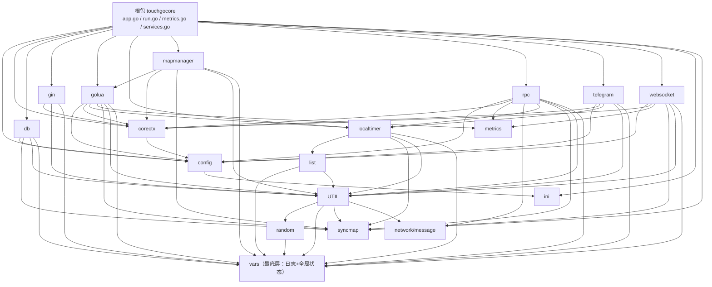

# TouchGoCore 项目结构优化方案

> 生成日期：2026-09-11　|　module：`touchgocore`（Go 1.25.8，单 go.mod）

## 一、现状分析

### 1.1 包依赖图（仅项目内部依赖，自上而下）

**层次结论**：`vars / syncmap / metrics / ini / random` 为底层；`config→ini`、`corectx→config`；`util→random/vars`、`list→vars`；db/rpc/websocket/gin/golua/mapmanager/telegram 为中层；根包聚合全部。层次本身健康，无需大规模调整包归属。

### 1.2 核心问题清单

| # | 问题 | 位置 | 影响 |
|---|------|------|------|
| 1 | **死代码**：`OptimizedLoggerManager` 全套（管理器+门面 `InitializeOptimized/*Opt/*WithFields`，417 行）在包外零引用，是未接线的第二套日志实现 | `vars/logger_manager.go`、`vars/vars.go` 内 `OptimizedZapSlogHandler`（L788-945） | ~600 行冗余，维护混乱 |
| 2 | vars 单文件过大：`vars.go` 945 行混杂 LogConfig/同步管理器/handler/门面 | `vars/vars.go` | 可读性差 |
| 3 | 其余大文件：`localtimer/time.go` 755 行、`ranking/ranking.go` 710 行、`db/mysql.go` 530 行、`db/mongo.go` 470 行、`golua/luamain.go` 570 行 | 各包 | 职责混杂 |
| 4 | 根包 `app.go` 465 行中 ~100 行是 8 个服务适配器，与容器职责无关 | `app.go` | 职责不清 |
| 5 | `go-swd/` 目录名与包名（`swd`）不一致，且无任何调用方，完全自包含 | `go-swd/`（51 文件） | 命名不规范的独立子库 |
| 6 | `ChannelLoggerManager`（异步通道日志，850 行单文件）内聚了通道/统计/管理器/门面四类职责 | `vars/async_channel_logger.go` | 可读性差 |

### 1.3 vars 包日志真实运行路径（勘探结论）

- `vars.Initialize` → 创建 `ChannelLoggerManager`，将其 slog.Logger 设为 `slog.SetDefault` → 包级 `Info/Warning/Error` 门面经 `GetChannelLogger()` 分发（异步路径）
- `LoggerManager`（同步版）+ `ZapSlogHandler` 仍被 `Initialize` 创建作为 fallback，**需保留**
- `OptimizedLoggerManager` + `OptimizedZapSlogHandler` → **死代码，移除**
- 外部强依赖 API（必须保持签名）：`Info`(~107处)、`Error`(~90处)、`Warning`(~24处)、`Run`/`Shutdown`（app.go 各 1 处）、`LogConfig` 字段（app.go `initLogger`）

## 二、目录调整方案

| 变更 | 说明 | 风险 |
|------|------|------|
| `go-swd/` → `swd/` | 目录名对齐包名；无调用方，仅 import 路径概念变化（无人 import） | 极低 |
| `example/` 保持原位 | 会被 `go build ./...` 编译，兼作回归验证 | — |
| 其余包目录不动 | 依赖层次健康，仅做文件内拆分 | — |

## 三、大文件拆分清单（同包拆分，包级 API 不变）

### 3.1 根包

| 拆分前 | 拆分后 | 内容 |
|--------|--------|------|
| `app.go`（465行） | `app.go` | App 容器、Service 接口、NewApp/loadConfig/initLogger/initDatabase/registerServices/Start/Shutdown/closeDatabase/GetApp/Context/GetRpcClient/GetRpcServer/GetWSClient |
| | `services.go` **[新]** | 8 个服务适配器：timer/websocket/lua/rpc/telegram/map/gin/metrics |

### 3.2 vars 包

| 拆分前 | 拆分后 | 内容 |
|--------|--------|------|
| `vars.go`（945行） | `log_config.go` **[新]** | `LogConfig`、`DefaultConfig`、`Validate`、级别常量 |
| | `sync_logger.go` **[新]** | `LoggerManager`、`ZapSlogHandler`（同步 fallback 路径）、`createZapCore`/`callerEncoder` 等辅助 |
| | `vars.go` | 全局门面：`Run`/`Initialize`/`InitializeWithDefaults`/`Shutdown`/`Debug`/`Info`/`Warning`/`Error` + 私有辅助；移除 `OptimizedZapSlogHandler`/`OptimizeCallerEncoder`/`createOptimizedZapCore` |
| `logger_manager.go`（417行） | **删除** | `OptimizedLoggerManager` 全套 + `InitializeOptimized/*Opt/*WithFields` 门面（死代码，零外部引用） |
| `async_channel_logger.go`（850行） | `async_channel.go` **[新]** | `AsyncChannelConfig`、`AsyncLoggerChannel`、`AsyncChannelStats` |
| | `channel_logger_manager.go` **[新]** | `ChannelLoggerManager` |
| | `async_facade.go` **[新]** | `InitializeChannelLogger` 等全局门面 |

### 3.3 其他包（均同包拆分，外部 import 不变）

| 文件 | 拆分后 |
|------|--------|
| `localtimer/time.go`（755行） | `timer.go`（Timer/TimerPool/TimerInterface）、`timer_manager.go`（TimerWheel/TimerManager）、`timer_facade.go`（Run/TimeStop/AddTimer/TimeTick 等全局 API） |
| `ranking/ranking.go`（710行） | `skiplist.go`（跳表内部实现）、`rank_tree.go`（RankInfo/RankTree）、`ranking_store.go`（LoadRanking/SaveRanking/全局 RTS 门面） |
| `db/mysql.go`（530行） | `mysql.go`（连接管理/事务）、`mysql_crud.go`（CRUD/聚合/分页）、`mysql_query.go`（链式查询封装） |
| `db/mongo.go`（470行） | `mongo.go`（连接管理）、`mongo_crud.go`（CRUD）、`mongo_gridfs.go`（GridFS/Bulk） |
| `golua/luamain.go`（570行） | `luascript.go`（LuaScript 类型与配置辅助）、`lua_facade.go`（包级 Call/Register/Run/Stop）、`lua_register.go`（registerDefaultFunctions/registerClass）、`lua_timer.go`（luaTimer） |

## 四、兼容性策略

1. **根包对外 API 不变**：`Run`/`RunWithApp`/`NewApp`/`GetApp`/`Service` 接口签名原样保留
2. **vars 包级 API 不变**：`Run/Initialize/Shutdown/Info/Warning/Error/Debug` + Channel 系列门面签名原样保留；仅删除死代码 `InitializeOptimized/*Opt/*WithFields`（零外部引用）
3. **各业务包拆分为同包多文件**：import 路径零变化
4. **不引入运行时行为变更**：纯结构性重构

## 五、风险项与验证

| 风险 | 缓解 |
|------|------|
| git 已有未提交改动（gin/run.go、telegram/telegram.go） | 在其基础上增量修改，不回滚不覆盖 |
| vars 死代码误删仍被引用 | 删除前已 grep 确认零引用；`go build ./...` 兜底 |
| 拆分遗漏符号 | 每拆一个包立即 `go build` 该包，最后全量 `go build ./... && go vet ./... && go test ./...` |

## 六、执行顺序

1. 根包拆分（app.go → services.go）
2. vars 重构（删死代码 + 拆 5 个文件）
3. localtimer / ranking / db / golua 拆分
4. `go-swd/` → `swd/` 重命名
5. 全量构建/静态检查/测试验证
